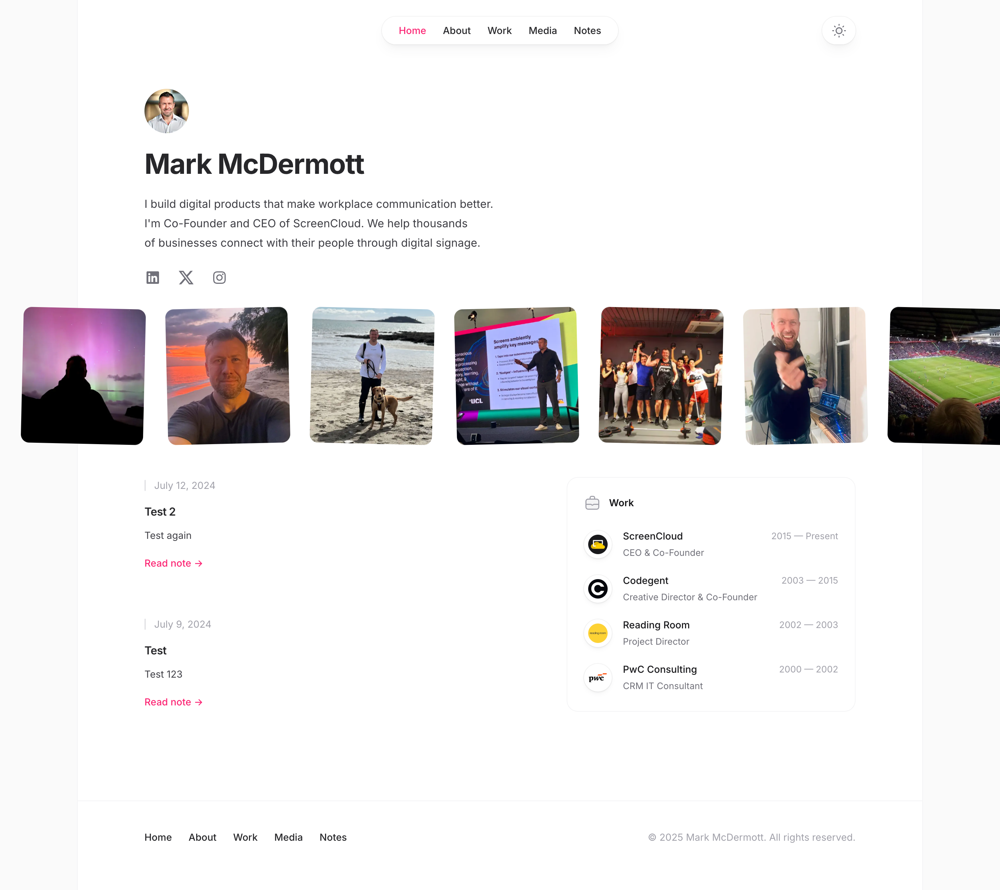

# Mark McDermott - Personal Website

My personal website built with Next.js, TypeScript, and Notion as a headless CMS.



## Tech Stack

- [TypeScript](https://www.typescriptlang.org/)
- [Next.js](https://nextjs.org/)
- [Notion API](https://developers.notion.com/) - for blog content management
- [Tailwind CSS](https://tailwindcss.com) - for styling
- [Vercel OG](https://vercel.com/docs/concepts/functions/edge-functions/og-image-generation) - for dynamic social images
- [Next Themes](https://github.com/pacocoursey/next-themes) - for dark mode
- [Framer Motion](https://www.framer.com/motion/) - for animations

## Features

- 📝 Blog powered by Notion CMS with enhanced fields
- 📄 Pagination support (10 posts per page)
- 🏷️ Tag filtering with sticky sidebar navigation
- 🌓 Dark/light mode
- 📱 Fully responsive
- 🚀 Fast page loads with SSR for dynamic content
- 🔍 SEO optimized with comprehensive meta tags
- 📊 Analytics with Vercel
- 🖼️ Dynamic OG images with fallback support
- 🐦 Twitter card integration
- 📡 RSS feed
- 🎨 Visual category icons for media sections
- 📧 Contact form with email delivery via Resend
- 💼 LinkedIn integration for networking

## Running Locally

### Prerequisites

1. Node.js 18+ and npm
2. A Notion account with a database for blog posts
3. Environment variables (see below)

### Environment Variables

Create a `.env.local` file with:

```bash
NEXT_PUBLIC_URL=http://localhost:3000
NOTION_TOKEN=your_notion_integration_token
NOTION_DATABASE_ID=your_notion_database_id
RESEND_API_KEY=your_resend_api_key # For contact form emails
```

### Notion Database Setup

Your Notion database needs these properties:

**Core Fields** (Required):
- `title` (title) - Post title
- `description` (text) - Short description for previews
- `slug` (text) - URL path (e.g., "my-post-title")
- `publishedAt` (date) - Publication date
- `hashtags` (multi-select) - Tags for categorization
- `cover` (files & media) - Optional cover image
- `contentStatus` (select) - Options: Draft, In Review, Ready to Publish, Published, Archived

**Enhanced Fields** (Recommended):
- `seoTitle` (text) - SEO-optimized title for search engines
- `metaDescription` (text) - Meta description for search results
- `excerpt` (text) - Short snippet for social sharing
- `readingTime` (number) - Estimated reading time in minutes
- `wordCount` (number) - Total word count of the post
- `inProgress` (checkbox) - Optional flag to mark posts as work in progress

**Note**: Posts will only be displayed if `contentStatus` is set to "Published".

### Installation

```bash
# Clone the repository
git clone https://github.com/mhmcdermott/markmcdermott.co.git
cd markmcdermott.co

# Install dependencies
npm install

# Run development server
npm run dev

# Build for production
npm run build

# Start production server
npm start
```

## Development Commands

```bash
npm run dev          # Start development server
npm run build        # Build for production
npm run start        # Start production server
npm run lint         # Run ESLint
npm run typecheck    # Run TypeScript type checking
npm run format       # Format code with Prettier
```

## Recent Updates

### Blog/Notes Enhancements (2025)
- **Pagination**: Notes page now shows 10 posts per page with navigation controls
- **Improved Layout**: Tags moved to sticky right sidebar on desktop for better navigation
- **Better Typography**: Optimized font sizes for improved readability
- **Enhanced SEO**: Support for custom SEO fields (seoTitle, metaDescription)
- **Reading Time**: Display estimated reading time for each post
- **LinkedIn Integration**: Replaced social sharing with LinkedIn connection CTA
- **Error Handling**: Improved resilience with Notion API error handling

## Project Structure

```
├── public/           # Static assets
│   └── og-default.svg # Fallback OG image
├── src/
│   ├── components/   # React components
│   │   └── Pagination.tsx # New pagination component
│   ├── data/         # Static data (bio, work history, etc.)
│   ├── images/       # Image assets
│   │   ├── life/     # Personal photos
│   │   ├── logos/    # Company logos
│   │   └── media/    # Media category icons
│   ├── lib/          # Utility functions and APIs
│   │   └── notesApi.ts # Enhanced with pagination support
│   ├── pages/        # Next.js pages
│   └── styles/       # Global styles
├── .github/          # GitHub Actions workflows
└── CLAUDE.md         # AI assistant context
```

## Deployment

The site is automatically deployed to Vercel on push to the `master` branch.

## License

[MIT](LICENSE)

## Acknowledgments

This website was originally forked from [Bartosz Jarocki's personal website](https://github.com/BartoszJarocki/jarocki.me) and heavily customized.